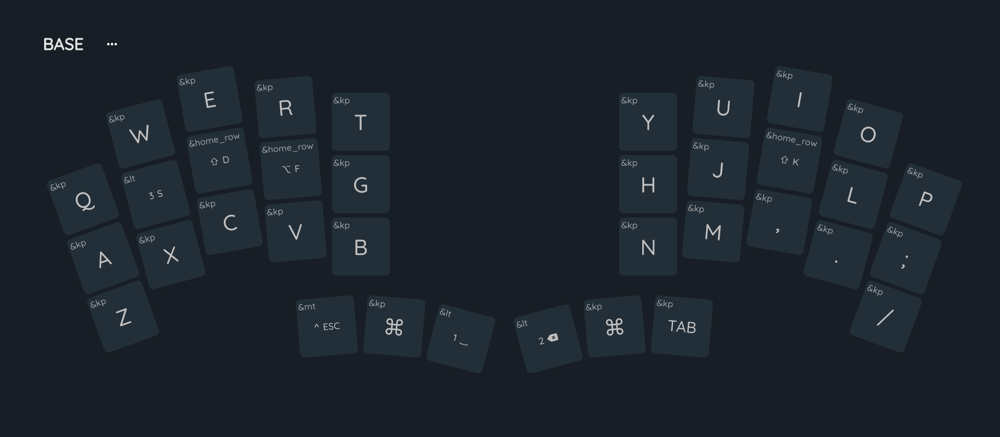
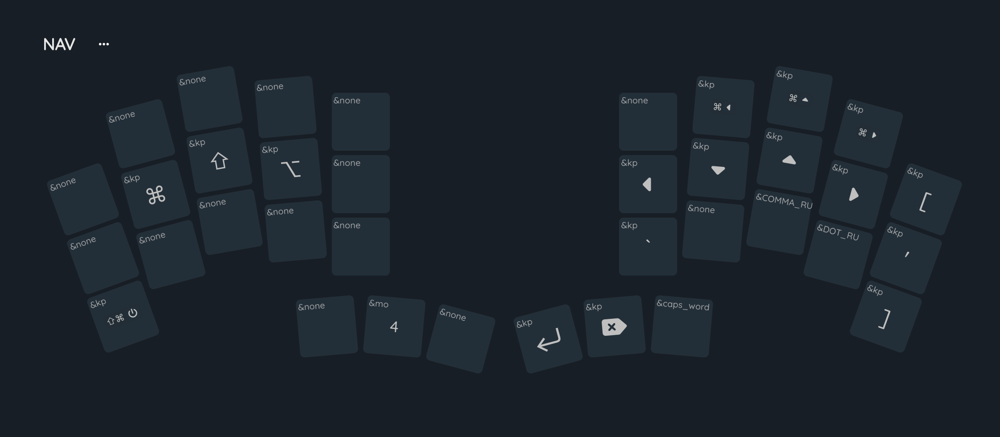
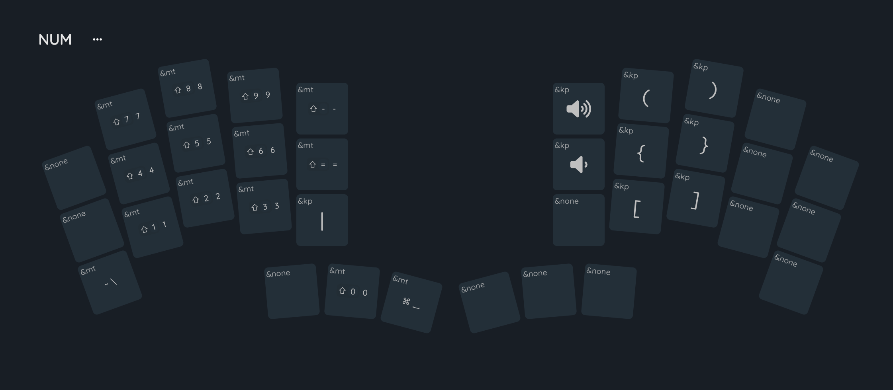
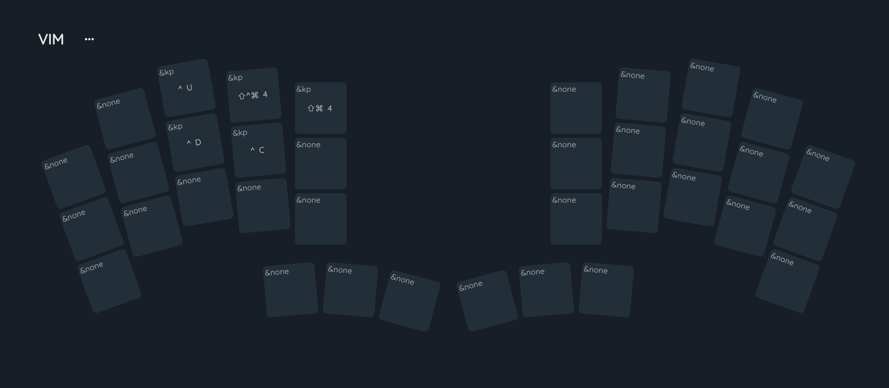
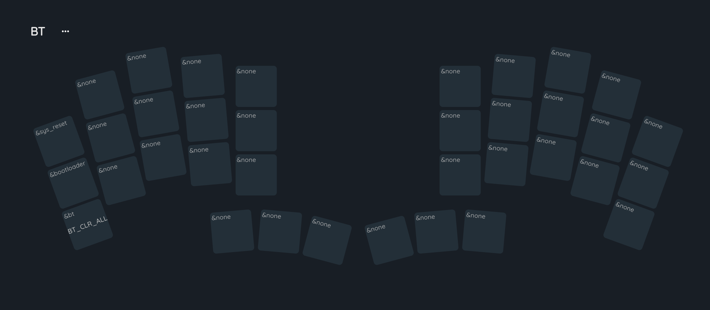

# Клавиатурная раскладка для 36 клавиш

## Base layer

## Nav layer

## Num layer

## Vim layer

## BT layer

## Ссылки

- [редактор раскладок](https://nickcoutsos.github.io/keymap-editor/)
- [редактор визуализации](https://nickcoutsos.github.io/keymap-layout-tools/)
- [ZMK дока](https://zmk.dev/docs)
